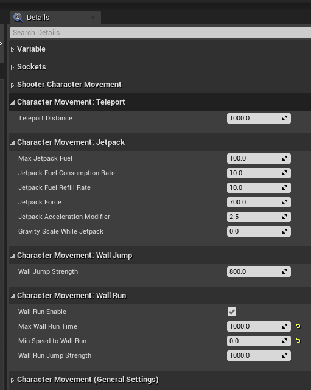

# ShooterGame

The Unreal Engine 4 ShooterGame example with some custom modifiers. Each modifier works properly 
in multiplayer and expose properties in the MovementComponent of the blueprints PlayerPawns and BotPawns.

The following modifiers have been implemented:
      
* Teleport 
* Jetpack 
* Wall jump 
* Wall run 
* Freezing gun
* Player drops his remaining rifle ammo when die

## Controls

* Teleport: T
* Activate jetpack: Left Ctrl (hold) 
* Side jump: Press space near a wall while holding LeftCtrl (jetpack)
* Wall run: Go near a wall with a jump or with the jetpack and keep a minimum XY velocity
* Freezing gun: Change weapon (mouse well up/down)
* Drop ammo: When the player die

## Configurable parameters

The new movements expose some parameters in the CharacterMovement component of the PlayerPawn and BotPawn blueprints. These are shown in the following figure:

  

## BOTs
The BOTs cannot use the new abilities, but they interact with the player that instead use them. The BOTs are affected from the freezing gun hits, and they pick up ammo dropped from death players.

## Implementation notes
The custom moves have been implemented with the combined use of compressed flags, properties replication and RPC calls. As rule of thumb, I tried to minimize the use of replicated properties and RPC calls to keep the network traffic as light as possible.

During the development I had to make some choices on how the mutator works for situations that occurred outside the test specifications. In the following I give a brief explanation of the choices made.

### Teleport
The character can teleport himself forward of a given distance. The default value is 10000uu (10 meters, world to meters set to 100). 
The character is teleported forward to the teleport distance if no obstacles are encountered on the line between the start and the final location, otherwise it stops before the first obstacle. This is done to avoid teleporting inside walls or to unreachable map zones.

### Jetpack, wall jump and wall run
Due both wall jump and wall run have been implemented, I had to choice how flying near a wall interacts with both.
If the player is flying near a wall with the jetpack active (i.e. the button that corresponds to the jetpack action is pressed) and a jump action is executed the player make a jump that push him a little higher and in the normal wall direction, as required from the test.
But due the character is able to also wall run, I thought that the player expects a smooth transition to wall running when he is falling near a wall. 
So if the player deactivate the jetpack and start falling near a wall it transitions to a wall run, if it has the minimum required velocity to execute the movement.
A character can wall run only if he has and maintains a minimum speed. This value is configurable and could be also 0, in that case it sticks to the walls. 
A player can wall run continuously for a maximum configurable time (default 3.5 sec), and then it fall down. 
While wall running a player can move upwards and downwards the wall.
While wall running a player can turn on himself, as soon as he maintains the minimum speed, and can execute a jump in the looking direction, but, despite the direction, a jump always push him a little away the wall.
The wall run can be executed only on the objects that are tagged as “Wall”. This has required an additional level editing on both the maps “Highrise” and “Sanctuary”, but it’s more efficient due it speeds up the collision detection process and gives a finer control on the gameplay, avoiding unpredictable situations.
In particular, the “Sanctuary” level required a little bit more work due all the walls were Geometry Brush Actors. I had to generate bounding volumes from them, then tag these as “Walls”. Anyway the level design with a lot of asperities on the walls it’s not well suited for a wall run dynamic.

### Freezing Gun
The freezing gun has infinite ammo, it fires projectiles and freezes for a given time all the characters in the area near the impact.

### Drop Weapon
For the sake of simplicity, when a character dies he drops only his rifle weapon with the remaining rifle ammo.
